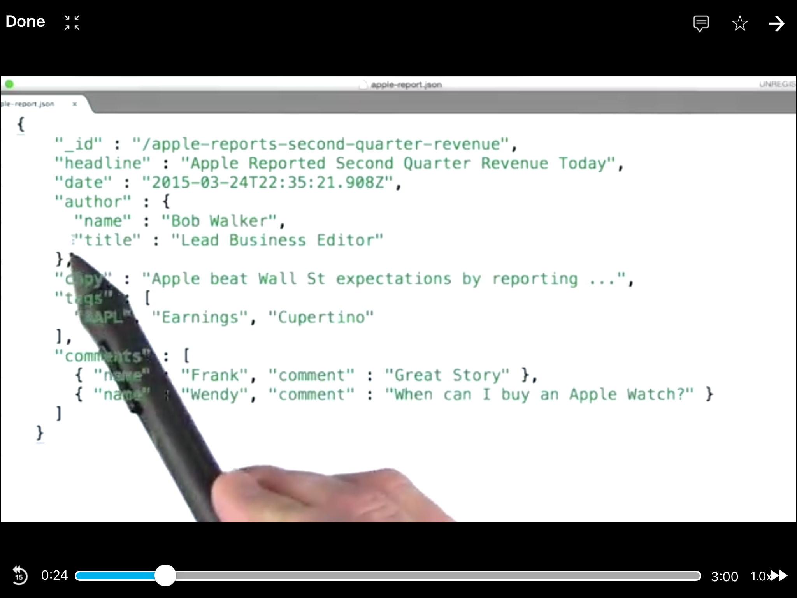
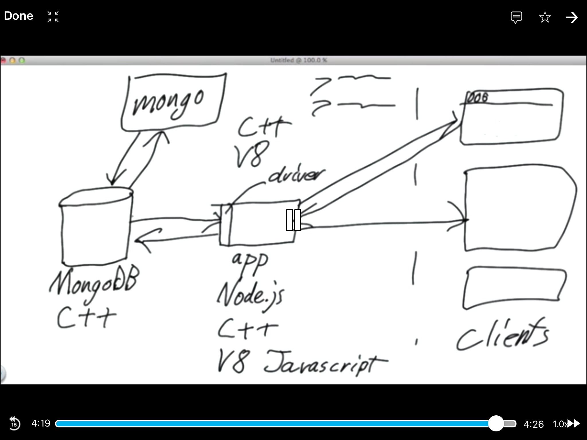
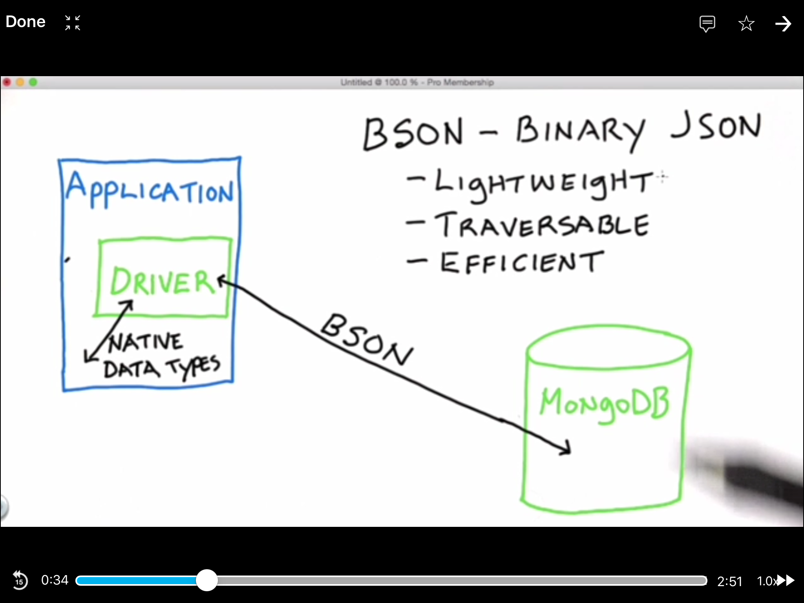

# M101JS: MongoDB for Node.js Developers

[https://university.mongodb.com/courses/catalog](https://university.mongodb.com/courses/catalog)

## Chapter 1: Introduction

1. What is MongoDB?
	
	
	
	
	
	
	
2. Overview of Building an App with MongoDB

	
	
	
3. JSON

	JSON has <b>6</b> data types: string, number, boolean, null, array and object.
	
		{
			"name": "jill",
			"age": 21,
			"voted": true,
			"school": null,
			"likes": ["tenis", "math"],
			"addr": {
				"city": "LA",
				"state": "WA"
			}
		}

	
4. BSON

	
	
5. Install MongoDB

		# download and untar
		tar xvf *.tgz
		# copy bin to /usr/local/bin
		cp * /user/local/bin
		# make /data/db directory
		mkdir /data/db
		# chmod
		chmod 777 /data/db
		# run mongod
		mogod
		# run mongo client
		mongo
		# insert and query
		db.names.insert({"name": "wqfeng"})
		db.names.find()
				
7. Intro to Creating and Reading Documents

		> db.movies.insertOne({title: "Jaws", year: 1975, "imdb": "tt0073195"})
		
		db.movies.find().pretty()
		
		db.movies.find({year: 1981})
		
		> var c = db.movies.find()
		> c.hasNext()
		  true
		> c.next()

8. Installing Node.js
9. Hello World on Node.js

		var http = require('http');

		var server = http.createServer(function(request, response){
        response.writeHead(200, {'Content-Type': 'text/plain'});
        response.end("Hello, World\n");
		});

		server.listen(8000);
		console.log("Server running at http://localhost:8000");
                  
10. Introduction to npm
		
	package.json
		
		{
  		"name": "intro_to_npm",
  		"version": "0.0.0",
  		"description": "npm introduction",
  		"main": "app.js",
  		"dependencies": {
   	 		"consolidate": "~0.9.1",
    		"express": "3.x",
    		"mongodb": "~1.3.10"
  		},
  		"author": "Shaun Verch",
  		"license": "BSD"
		}
		
	`npm install`

11. Intro to the Node.js Driver

	`npm install mongodb`

		var MongoClient = require('mongodb').MongoClient,
    		assert = require('assert');

		var url = 'mongodb://localhost:27017/test';

		MongoClient.connect(url, function(err, db) {

    	assert.equal(null, err);
    	console.log("Successfully connected to server");

    	// Find some documents in our collection
    	db.collection('movies').find({}).toArray(function(err, docs) {

        // Print the documents returned
        docs.forEach(function(doc) {
            console.log(doc.title);
        });

        // Close the DB
        db.close();
    	});

    	// Declare success
    	console.log("Called find()");
		});

		
11. Hello World using Express

		var express = require('express'),
    		app = express();

		app.get('/', function(req, res){
    		res.send('Hello World');
		});

		app.use(function(req, res){
    		res.sendStatus(404);
		});

		var server = app.listen(3000, function() {
    		var port = server.address().port;
    		console.log('Express server listening on port %s', port);
		});

12. Hello World using Templates

	app.js
	
		var express = require('express'),
    		app = express(),
    		engines = require('consolidate');

		app.engine('html', engines.nunjucks);
		app.set('view engine', 'html');
		app.set('views', __dirname + '/views');

		app.get('/', function(req, res) {
    		res.render('hello', { name : 'Templates' });
		});

		app.use(function(req, res){
    		res.sendStatus(404);
		});

		var server = app.listen(3000, function() {
    		var port = server.address().port;
    		console.log('Express server listening on port %s', port);
		});
		
	hello.html
	
		<h1>Hello, {{name}}!</h1>

	
13. All Together Now

	app.js
	
		var express = require('express'),
    		app = express(),
    		engines = require('consolidate'),
   			MongoClient = require('mongodb').MongoClient,
    		assert = require('assert');

		app.engine('html', engines.nunjucks);
		app.set('view engine', 'html');
		app.set('views', __dirname + '/views');

		MongoClient.connect('mongodb://localhost:27017/test', function(err, db) {

    		assert.equal(null, err);
    		console.log("Successfully connected to MongoDB.");

    		app.get('/', function(req, res){

        		db.collection('movies').find({}).toArray(function(err, docs) {
            		res.render('movies', { 'movies': docs } );
        	});

    	});

    	app.use(function(req, res){
        res.sendStatus(404);
    	});

    	var server = app.listen(3000, function() {
        var port = server.address().port;
        console.log('Express server listening on port %s.', port);
    	});

		});

	movies.html
	
		<head>
		
		</head>

		<h1>Movies</h1>
		
  		<li><a href="http://www.imdb.com/title/		{{ movie.imdb }}">{{ movie.title }}, {{ movie.year }}</a></li>
		
  		<li>No movies found.</li>
		

14. Express: Handling GET Requests

		var express = require('express'),
    		app = express(),
    		engines = require('consolidate');

		app.engine('html', engines.nunjucks);
		app.set('view engine', 'html');
		app.set('views', __dirname + '/views');

		// Handler for internal server errors
		function errorHandler(err, req, res, next) {
    		console.error(err.message);
    		console.error(err.stack);
    		res.status(500).render('error_template', { error: err });
		}

		app.get('/:name', function(req, res, next) {
    		var name = req.params.name;
    		var getvar1 = req.query.getvar1;
    		var getvar2 = req.query.getvar2;
    		res.render('hello', { name : name, getvar1 : getvar1, getvar2 : getvar2 });
		});

		app.use(errorHandler);

		var server = app.listen(3000, function() {
    		var port = server.address().port;
    		console.log('Express server listening on port %s.', port);
		});
		
15. Express: Handling POST Requests

	app.js

		var express = require('express'),
    		app = express(),
    		engines = require('consolidate'),
    		bodyParser = require('body-parser');

		app.engine('html', engines.nunjucks);
		app.set('view engine', 'html');
		app.set('views', __dirname + '/views');
		app.use(bodyParser.urlencoded({ extended: true }));

		// Handler for internal server errors
		function errorHandler(err, req, res, next) {
    		console.error(err.message);
    		console.error(err.stack);
    		res.status(500).render('error_template', { error: err });
		}

		app.get('/', function(req, res, next) {
    		res.render('fruitPicker', { 'fruits' : [ 'apple', 'orange', 'banana', 'peach' ] });
		});

		app.post('/favorite_fruit', function(req, res, next) {
    		var favorite = req.body.fruit;
    		if (typeof favorite == 'undefined') {
        		next('Please choose a fruit!');
    		}
    		else {
        		res.send("Your favorite fruit is " + favorite);
    		}
		});

		app.use(errorHandler);

		var server = app.listen(3000, function() {
    		var port = server.address().port;
    		console.log('Express server listening on port %s.', port);
		});
		
	fruitPicker.html
		
		<!doctype HTML>
		<html>
  		<head><title>Fruit Picker</title></head>
  		<body>
    		 <form action="/favorite_fruit" method="POST">
        		
What is your favorite fruit?

        		
          	

            		<input type="radio" name="fruit" value="{{fruit}}"/>{{fruit}}
          	

        		
        		<input type="submit" value="Submit"/>
     		</form>
  		</body>
		</html>	
		
16. Restore from dump

	`mongorestore dump`	

