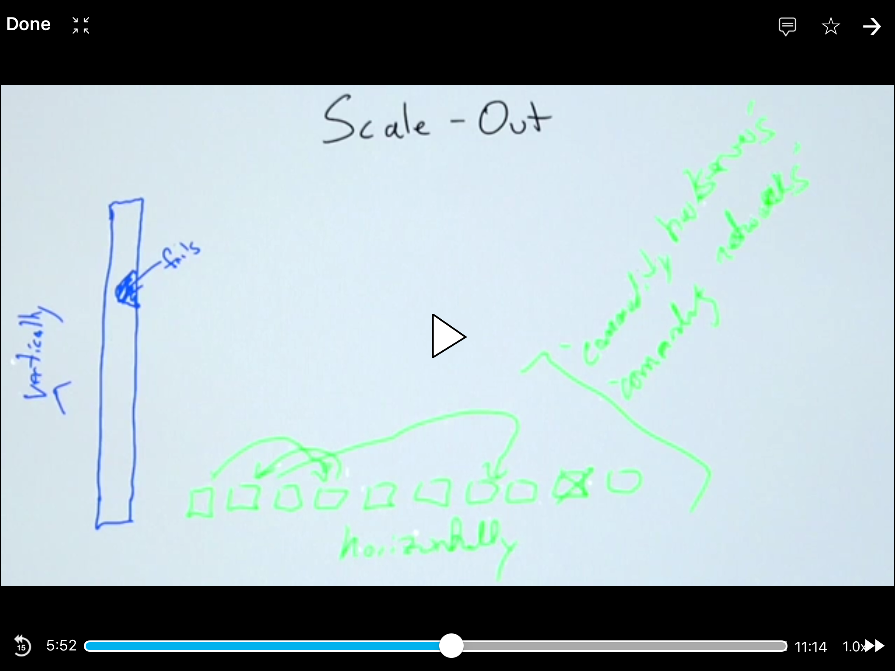
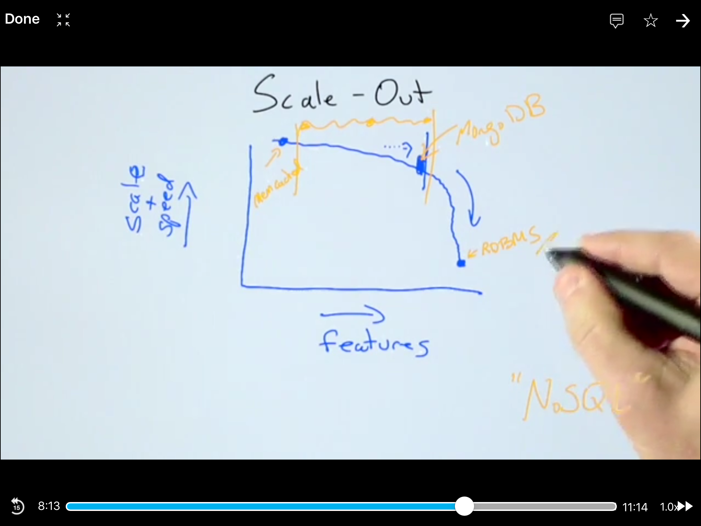
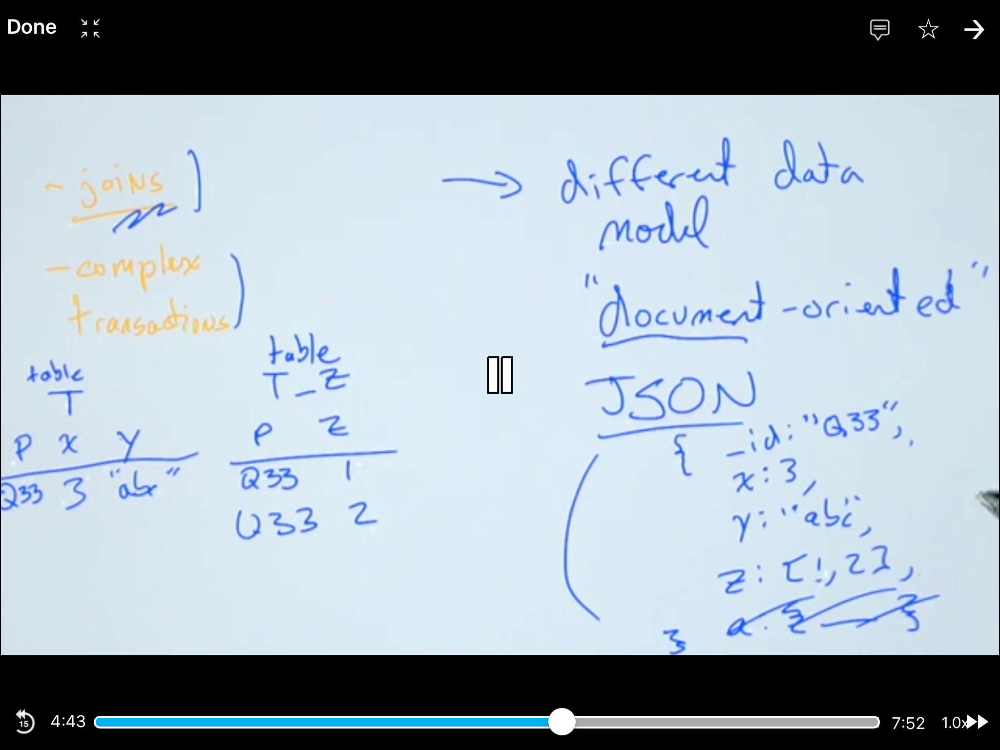
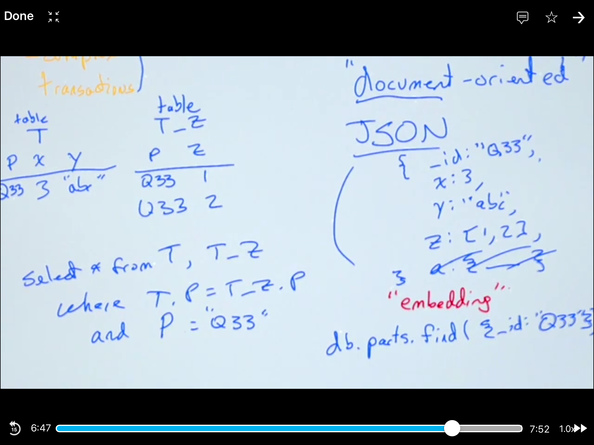
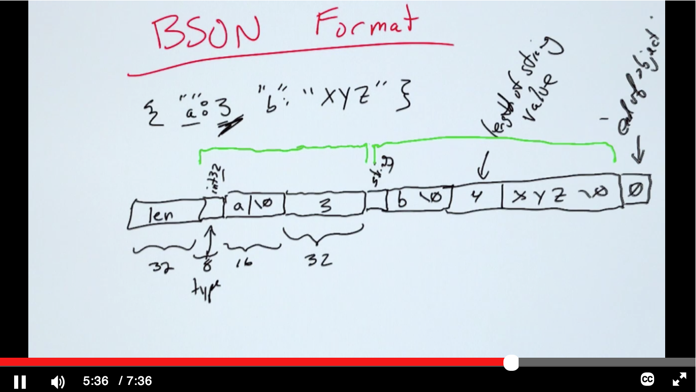
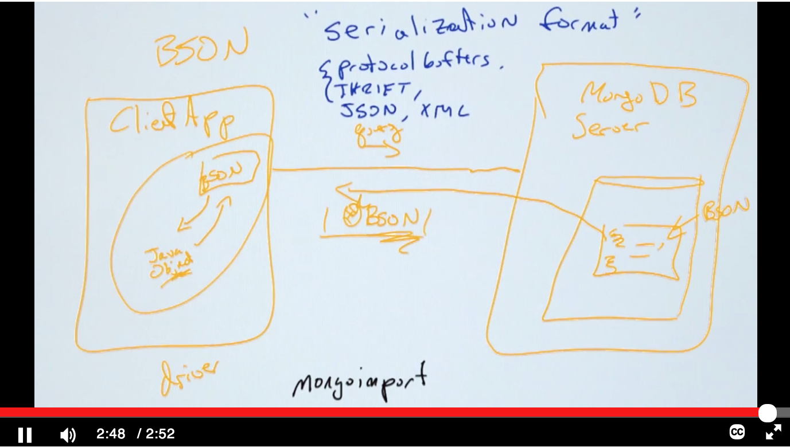

# M102 MongoDB for DBAs

[https://university.mongodb.com/courses/catalog](https://university.mongodb.com/courses/catalog)

## Chapter 1: Introduction

1. Why MongoDB?
	
	Relational Database was invented decades ago. The IT word changes a lot.
	
	
	
2. Scaling

	
	
	
	
3. SQL and Complex Transactions

	
	
4. Documents Overview

	
	
5. Install MongoDB

		# download and untar
		tar xvf *.tgz
		# copy bin to /usr/local/bin
		cp * /user/local/bin
		# make /data/db directory
		mkdir /data/db
		# chmod
		chmod 777 /data/db
		# run mongod
		mogod
		# run mongo client
		mongo
		# insert and query
		db.names.insert({"name": "wqfeng"})
		db.names.find()
		
6. JSON Types

	JSON has <b>6</b> data types: string, number, boolean, null, array and object.
	
		{
			"name": "jill",
			"age": 21,
			"voted": true,
			"school": null,
			"likes": ["tenis", "math"],
			"addr": {
				"city": "LA",
				"state": "WA"
			}
		}
			
7. JSON Syntax
8. Binary JSON

	
	
	
9. BSON and applications

	
10. Dynamic Schema
11. MongoDB Shell
12. Mongoimport

		mongoimport --db pcat --collection products < productions.json
13. Cursors

		db.movies.find()
		# to array
		db.movies.find().limit(10).toArray()
		
		# the query will give 20 items once, use it to iterate
		it
		# count
		db.movies.count()
		# find with query
		db.movies.find({name: "xxx"})
14. Query Language: Basic Concepts

		show dbs
		show collections
		
		# find one
		db.products.findOne()
		
		# limit lazy evaluation
		db.products.find({}).limit(10)
		
		# skip and sort
		db.products.find().limit(2).skip(10).sort(...)
		db.products.find({}, 2, 10, ...)
		
		# filter
		db.products.find({}, {name:1, _id:0})
		
15. Query Language: Projection
16. Query Language: Advantages of a Dynamic Schema

	
17. Shell: Queries

		db.products.find({price:{$gte:200}}, {name:1, price:1})
		
	
	
	
		
18. Sorting

	

		db.products.find({}, {name:1, price:1}).sort({price:1})
		
19. Query Language: Cursors

	
	
20. Deep Dive into the Course Going Forward

	
	
	
	
	
	
## Chapter 2: CRUD and Administrative Commands

1. Insertion

		db.temperature.insert({ x : 3 , y : 4 })
		
2. Update

		db.sample.update({_id: "101"}, {x: 1, y: 2})
		
		
		var temp = db.sammple.findOne();
		temp.x = 1;
		temp.y = 2;
		db.sample.update({_id: "101"}, temp)
		
		//save to update
		db.sample.save(temp)
		
3. Partial Updates & Document Limits

		t.update({_id:101}, {$push: {arr: "hi"}})
		t.update({_id:100}, {$set: {available: 1}})
4. Removing Documents

		db.users.remove({"addr.city": "Lyon", registered: false})
		
5. Multi Update

		t.update({active: true}, {$inc: {priority: 1}}, {upsert: fase, multi: true})
		
6. Upsert

		t.update({_id: "/sports/football"}, {$inc: {views: 1}}, {upsert: true})
		
		db.users.update({_id: "Jane"}, {$addToSet: {likes: "football"}}, {upsert: true})

7. Wire Protocol
8. Bulk() Operations and Methods

		var bulk = db.items.initializeUnorderedBulkOp();
		bulk.insert({item: "abc123", status: "A", points: 200})
		bulk.insert({item: "abc13", status: "B", points: 200})
		bulk.insert({item: "abc23", status: "C", points: 200})
		
		bulk.execute()
		
		var b = db.items.initializeOrderedBulkOp()
		b.find({item: "abc123"}).remove()
		b.find({item: "ijk123"}).update({$inc: {points: 1}})
9. Common Commands

		db.runCommand({listDatabases: 1})
		db.serverStatus()
		db.currentOp()
		db.killOp(101)
		db.test.stats()
		db.test.drop()

